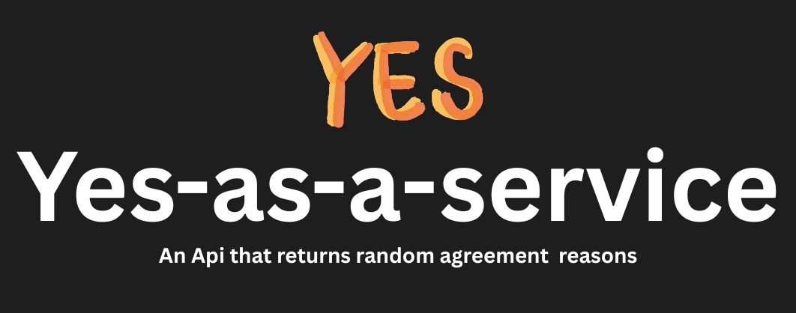
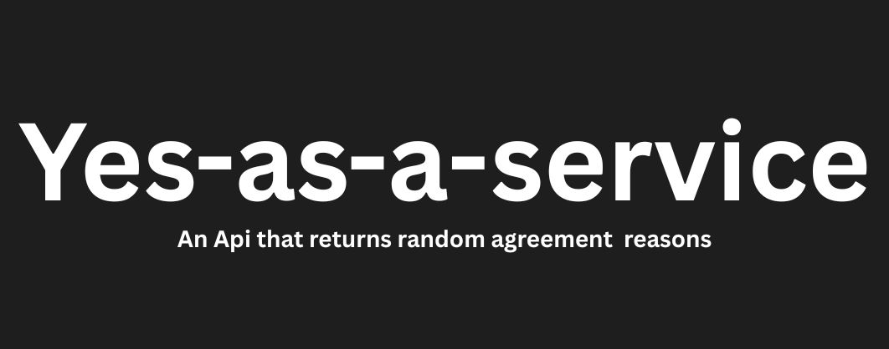

# 💅 Yes-as-a-Service

Ever wanted to sprinkle a little extra sass and confidence into your yeses? Yaaas queen! 💖💅
This fabulous API serves up random, witty, and unapologetically enthusiastic affirmative responses — perfect for any scenario: personal wins, dev life, student life, or just because you deserve it.

Think of it as revenge for all those times the world said "no" — your very own [No-as-a-Service](https://naas.isalman.dev/no) nemesis, but make it sparkle.

Built for humans, confidence, and unapologetic joy.

<p align="center">
  
</p>

---

Use it in apps, bots, landing pages, Slack integrations, motivational messages, or wherever you need a sparkling, unshakable yes.

---

## 🛠️ Self-Hosting

Want to run your own glam squad of yeses? It’s lightweight and fabulous.

### 1. Clone this repository

```bash
git clone https://github.com/novodude/yes-as-a-service.git
cd yes-as-a-service
```

### 2. Install dependencies

```bash
npm install
```

### 3. Start the server

```bash
npm start
```

Your API will shine at:

```
http://localhost:3000/yes
```

Change the port if you want a different vibe:

```bash
PORT=5000 npm start
```

---

## 📁 Project Structure

```
yes-as-service/
├── index.js            # Express API
├── responses.json      # 1000+ sparkling affirmative responses
├── package.json
├── .devcontainer.json  # VS Code / Github devcontainer setup
└── README.md
```

---

<p align="center">
  
</p>

## 📦 package.json

```json
{
  "name": "yes-as-service",
  "version": "1.0.0",
  "description": "A sassy API that returns random affirmative responses with flair.",
  "main": "index.js",
  "scripts": {
    "start": "node index.js"
  },
  "author": "novodude",
  "license": "MIT",
  "dependencies": {
    "express": "^4.18.2",
    "express-rate-limit": "^7.0.0"
  }
}
```

---

## ⚓ Devcontainer

Open in Github Codespaces or VSCode, and it’ll set up your dev environment automatically. Your yes squad awaits.

---

## 👤 Author

Crafted with sass, sparkle, and contagious optimism by [novodude](https://github.com/novodude) 💅

---

## 📄 License

MIT — do whatever, but always remember to say **yaaas queen** when the situation calls for it.

<p align="center">
  
</p>
